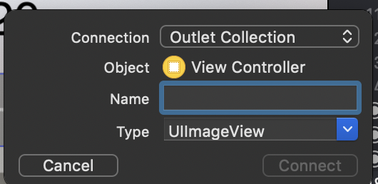
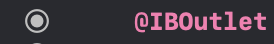
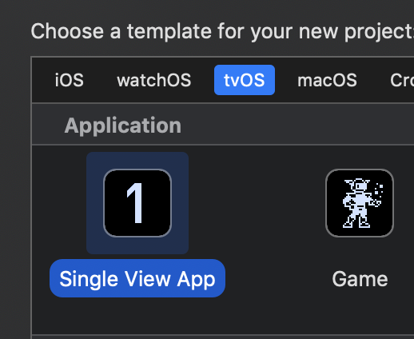
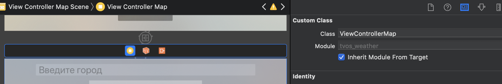
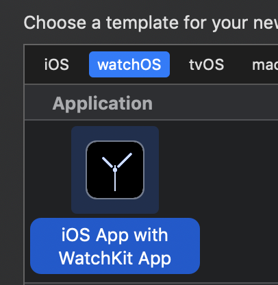
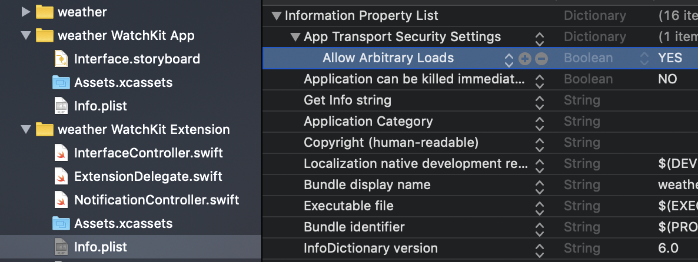
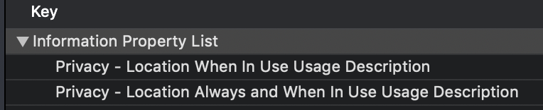

# Проект "Калькулятор"

Чтобы не обрабатывать каждую кнопку отдельно, можно при создании первого оутлета выбрать в connection вместо "outlet" "outlet collection" 



Сделать связь созданной коллекции с нужными кнопками и затем обрабатывать списком



```swift
for outlet in outletCollection {
    outlet.layer.borderWidth = 1
    outlet.layer.borderColor = UIColor.darkGray.cgColor
}
```

# Проект "погода"

Создаем новый проект

## добавление фона
* картинку перенести в папку Assets.xcassets В ПРИЛОЖЕНИИ
* на контроллер кладем ImageView
* выбираем загруженный фон

## делаем дополнительный контроллер для таблицы
* создаем КНОПКУ для перехода на следующий экран
* создаем контроллер TableView (так же как кнопки)
* можем задать таблице фон ``tableView.backgroundView = UIImageView.init(image: UIImage(named: "background3"))``
* кнопку связываем с контроллером (Show Detail)
* создаем новый swift файл для класса контроллера (File - New - File - Cocoa Touch Class); наследуемся от класса UITavleVewController
* в свойствах ячейки указываем Identifier "cityCell"

```swift
var cityList = [String]()

cityList.append("Москва")
tableView.reloadData()

override func numberOfSections(in tableView: UITableView) -> Int {
// #warning Incomplete implementation, return the number of sections
return 1
}

override func tableView(_ tableView: UITableView, numberOfRowsInSection section: Int) -> Int {
// #warning Incomplete implementation, return the number of rows
return cityList.count
}


override func tableView(_ tableView: UITableView, cellForRowAt indexPath: IndexPath) -> UITableViewCell {
let cell = tableView.dequeueReusableCell(withIdentifier: "cityCell", for: indexPath)

cell.textLabel?.text = cityList[indexPath.row]

return cell
}
```
## кастомизация отображения ячейки
* создаем новый swift файл, наследующий класс UITableViewCell
* в свойствах ячейки указываем созданный класс
* в ячейку добавляем нужные объекты (label...)
* outlet-ы объектов добавляем к классу

## меняем вывод названия города

```swift
override func tableView(_ tableView: UITableView, cellForRowAt indexPath: IndexPath) -> UITableViewCell {
let cell = tableView.dequeueReusableCell(withIdentifier: "cityCell", for: indexPath) as! TableViewCell

cell.cityLabel.text = cityList[indexPath.row]

return cell
}
```

## делаем добавление и удаление городов
* добавляем навбар и навбатттон
* от навбаттона делаем action в контроллер (перетаскиваем с ctrl ниже viewDidLoad)

//добавляем код в созданный action
```swift
@IBAction func addCity(_ sender: Any) {
    //создаем объекет Alert
    let alert = UIAlertController(title: "Добавление город", message: "Добавьте пожалуйста город!", preferredStyle: .alert)
    
    //добавляем к алерту текстовое поле
    alert.addTextField { (textField) in }
    
    //добавляем действие на кнопку ОК
    alert.addAction(UIAlertAction(title: "OK", style: UIAlertAction.Style.default, handler: { (alertAction) in
        //в алерте может быть несколько текстовых полей, поэтому нужно вытаскиваем по индексу
        let textField = alert.textFields![0] as UITextField
        
        //в свой список городов добавляем новый элемент
        self.cityList.append(textField.text!)
        
        //обновляем отображение
        self.tableView.reloadData()
        }))

    //создаем действие на кнопку отмены
    alert.addAction(UIAlertAction(title: "Cancel", style: .cancel, handler: { (alertAction) in }))
    
    self.present(alert, animated: true, completion: nil)
}
```

* переопределяем действие для удаления ячейки

```swift 
override func tableView(_ tableView: UITableView, commit editingStyle:  UITableViewCell.EditingStyle, forRowAt indexPath: IndexPath) {
    if editingStyle == .delete {
        // Delete the row from the data source

        cityList.remove(at: indexPath.row)
        tableView.deleteRows(at: [indexPath], with: .fade)
        tableView.reloadData()


    } else if editingStyle == .insert {
        // Create a new instance of the appropriate class, insert it into the array, and add a new row to the table view
    }
}
```

* переопределяем событие при выборе элемента списка
```swift
override func prepare(for segue: UIStoryboardSegue, sender: Any?) {
    if segue.identifier == "toMain" {
        let vc = segue.destination as! ViewController
        let index = self.tableView.indexPathForSelectedRow
        
        //обратите внимание - в ViewController должна быть объявлена переменная city
        vc.city = cityList[(index?.row)!]
    }
}
```

## Подключаем апи для получения прогноза погоды

### Добавляем библиотеки

1 устанавливаем поддержку cocoapods (если еще не установлен)
``sudo gem install cocoapods``

2 инициализируем pod  для нашего проекта (в каталоге с файлом проекта *.xcodeproj)
``pod init``

3 в созданном файле (Podfile) добавляем зависимости (названия библиотек) для работы с http и json
```
# проверяем название целевого проекта
target 'weather' do

...

# Pods for weather
pod 'Alamofire'
pod 'SwiftyJSON'

...
```

4 Устанавливаем зависимости
 ```pod install```
 
 5 Теперь вместо проекта нужно запускать *.xcworkspace
 
 6 Пересобираем проект, чтобы проверить ошибки версий библиотек (Product - Build)
 
 7 В ViewController.swift добавляем импорт нужных библиотек
```swift
import Alamofire
import SwiftyJSON
```

## Получение температуры и иконки (солнышко, тучки...)
С гитхаба копипастим пример запроса и заворачиваем его в функцию (ViewController)
```swift
func downloadData(city: String) {
    // токен для АПИ
    let token = "1e936ee21707e2a418e98dca00877357"

    // УРЛ с городом, метрической системой и токеном
    let urlStr = "https://api.openweathermap.org/data/2.5/weather?q=\(city)&units=metric&appid=\(token)"

    // перекодируем адрес (URLencode)
    let url = urlStr.addingPercentEncoding(withAllowedCharacters: .urlQueryAllowed)

    // посылаем запрос
    Alamofire.request(url!, method: .get).validate().responseJSON { response in
        switch response.result {
            case .success(let value):
                //если запрос выполнен успешно, то разбираем ответ и вытаскиваем нужные данные
                let json = JSON(value)
                self.temp = json["main"]["temp"].stringValue
                self.lblTemp.text = json["main"]["temp"].stringValue+"°C"
                
                //можно сразу запросить иконку (только нужно хранить название предыдущей, чтобы не запрашивать постоянно)
                let icoName = json["weather"][0]["icon"].stringValue
                
                if let urlStr2 = URL(string: "https://openweathermap.org/img/w/\(icoName).png") {
                    if let data = try? Data(contentsOf: urlStr2){
                        self.icoWeather.image = UIImage(data: data)
                    }
                } 
                
            case .failure(let error):
                print(error)
        }
    }
}
```
 
Запрашиваем температуру при отрисовке экрана
```swift
override func viewDidLoad() {
...
    downloadData(city: city)
```

## Простой способ хранить несекурные данные (последний выбранный город и список городов)

```swift
// получение ранее сохраненных данных
let city = UserDefaults.standard.string(forKey: "lastCity") ?? "Москва"

let savedList = UserDefaults.standard.stringArray(forKey: "cityList") ?? [String]()
for city in savedList {
    cityList.append(city)
}

// при изменении списка (добавили, удалили город) пересохраняем 
UserDefaults.standard.set(self.cityList, forKey: "cityList")

// при выборе города аналогично
UserDefaults.standard.set(cityList[(index?.row)!], forKey: "lastCity")
```

# Проект "tvOS" - погода на телевизоре

При создании проекта выбираем шаблон "tvOS" и так же "Single View App"



После создания файла для контроллера (второй экран) не забываем в свойствах контроллера указать созданный класс



Для поиска введенного города нужно связать текстовое поле с экземпляром класса (``tfCityName.delegate = self``) и реализовать функцию перехватчик ``textFieldShouldReturn``

```swift
override func viewDidLoad() {
    super.viewDidLoad()

    // связываем с собой, чтобы сработала функция "textFieldShouldReturn"
    tfCityName.delegate = self
}

func textFieldShouldReturn(_ textField: UITextField) -> Bool {
    searchCity(city: tfCityName.text!)
    return true
}
```

Чтобы при возврате на первый экран обновить информацию нужно переопределеить функцию ``viewWillAppear`` и снова вызвать функцию поиска погоды

```swift
override func viewWillAppear(_ animated: Bool) {
    loadWeatherInfo()
}
```
# "Погода" на часах



* Добавляем права для получения данных с сервера



При связи кнопки со вторым экраном выбираем "push"

# Проект "Достопримечательности"

> Сразу отмечу, что делал не по тексту лекции, а по этому туториалу: 
https://www.raywenderlich.com/548-mapkit-tutorial-getting-started

Для получения локации нужно запросить соответствующие права



1. Кидаем на экран MapView, делаем для нее оутлет в контроллере

2. Классу добавляем предков: MKMapViewDelegate, CLLocationManagerDelegate<br/>
```swift
class ViewController: UIViewController, MKMapViewDelegate, CLLocationManagerDelegate {
```

3. Объявляем переменную ``let locationManager = CLLocationManager()``

4. Пишем код

```swift
    override func viewDidLoad() {
        super.viewDidLoad()
        
        // назначаем свой класс, как обработчик событий карты 
        // (для этого наш класс должен наследоваться от MKMapViewDelegate)
        mapView.delegate = self

        // разрешаем показывать позицию пользователя на карте
        mapView.showsUserLocation = true
        
        if CLLocationManager.authorizationStatus() == .authorizedAlways {
            // аналогично назначаем свой класс обработчиком событий локатора (CLLocationManagerDelegate)
            locationManager.delegate = self
            let location = mapView.userLocation
            location.title = "Я здесь"
        } else {
            locationManager.requestAlwaysAuthorization()
        }
     
        // задаем кординату центра для карты (по идее можно использовать mapView.userLocation, но я все
        // достопримечательности расположил рядом с этими координатами)
        let location = CLLocationCoordinate2D(latitude: 51.50007773,
                                              longitude: -0.1246402)
        
        // задаем на карте область просмотра
        let span = MKCoordinateSpan(latitudeDelta: 0.05, longitudeDelta: 0.05)
        let region = MKCoordinateRegion(center: location, span: span)
        mapView.setRegion(region, animated: true)
        
        // добвляем на карту наши достопримечательности
        // здесь "places" массив объектов, описанный локально. В реальной жизни список объектов мы будем получать по сети 
        for p in places {
            mapView.addAnnotation(
                Artwork(title: p.title,
                        locationName: p.desc,
                        coordinate: p.coord))
        }
    }
```

5. Для геометок у меня используется класс Artwork

```swift
// класс, потомок MKAnnotation, практически цельнотянут из туториала, только убрал одно поле
class Artwork: NSObject, MKAnnotation {
    let title: String?
    let locationName: String
    let coordinate: CLLocationCoordinate2D
    
    // конструтор (описывает какие параметры нужны классу при создании)
    init(title: String, locationName: String, coordinate: CLLocationCoordinate2D) {
        self.title = title
        self.locationName = locationName
        self.coordinate = coordinate
        
        super.init()
    }
    
    // title и subtitle используются при отрисовке метки
    var subtitle: String? {
        return locationName
    }
}
```

6. И в конце добавляем функцию, которая вызывается при создании каждой геометки

```swift
    // функция вызывается для каждой показываемой точки
    internal func mapView(_ mapView: MKMapView, viewFor annotation: MKAnnotation) -> MKAnnotationView? {
        
        // проверяю, является ли метка экземпляром класса Artwork (т.е. метка с текущей позицией вылетит без обработки)
        guard let annotation = annotation as? Artwork else { return nil }
        
        let identifier = "marker"
        var view: MKMarkerAnnotationView
        
        if let dequeuedView = mapView.dequeueReusableAnnotationView(withIdentifier: identifier)
                as? MKMarkerAnnotationView {
            // сюда не заходит
            dequeuedView.annotation = annotation
            view = dequeuedView
        } else {
            // Создаю метку геолокации
            // я использую класс MKMarkerAnnotationView, т.к. он по клику на метке может разворачивать
            // дополнительную информацию
            view = MKMarkerAnnotationView(annotation: annotation, reuseIdentifier: identifier)

            // переопределяю символ и цвет фона геометки (можно поменять и форму геометки - в туториале это есть)
            view.glyphText = "🚗"
            view.markerTintColor = .blue

            // разрешаем показ дополнительной информации
            view.canShowCallout = true
            view.calloutOffset = CGPoint(x: -5, y: 5)

            // класс MKMarkerAnnotationView поддерживает отображение 3-х блоков: 
            // leftCalloutAccessoryView, detailCalloutAccessoryView, rightCalloutAccessoryView 

            // в правом блоке я вывожу изображение достопримечательности 
            // (тут опять же нужно бы грузить изображение с сервера, пока берется одно, вложенное в проект)
            let mapsButton = UIButton(  frame: CGRect(origin: CGPoint.zero,
                                        size: CGSize(width: 200, height: 200)))
            mapsButton.setBackgroundImage(UIImage(named: "bigban"), for: UIControl.State())
            view.rightCalloutAccessoryView = mapsButton

            // по идее класс MKMarkerAnnotationView отображает title и subtite из нашей метки
            // но при этом обрезает окно дополнительной информации по содержимому subtite
            // и если описание короткое, то изображение, которое мы добавили выше, обрезается

            // чтобы этого избежать, создается новый Label
            let detailLabel = UILabel()
            detailLabel.numberOfLines = 0
            detailLabel.font = detailLabel.font.withSize(12)
            detailLabel.text = annotation.subtitle

            // и в нем жестко прописывается минимальный размер по высоте картинки
            detailLabel.heightAnchor.constraint(equalToConstant: 200).isActive = true
            
            // созданный Label прописывается как центральный блок нашей метки 
            view.detailCalloutAccessoryView = detailLabel
        }
        return view
        
    }
```

## Добавляем посторение маршрута к выбранной достопримечательности

По идее выбор обычной геометки отслеживается функцией

```swift
func mapView(_ mapView: MKMapView, didSelect view: MKAnnotationView){}
```

Но так как в своем проекте я использую геометку с доп. информацией, то постоение маршрута делаю по клику на изображение достопримечательности. Для этого после создания кнопки (а изображение у нас положено на кнопку) добавляю для нее обработчик

```swift
// добавляем событие для нашей кнопки
mapsButton.addTarget(self, action: #selector(buttonClicked(_:)), for: .touchUpInside)
```

> В принципе это тоже самое, если в дизайнере создать action перетаскиванием

И соответсвенно пишем реализацию этой функции

```swift
// событие возникает при клике на картинку в детальном описании геометки
@objc func buttonClicked(_ sender: UIButton) {
    //очищаю старые пути
    self.mapView.removeOverlays(self.mapView.overlays)

    // беру координату позиции пользователи и выбранной геометки
    // в tag я храню индекс в массиве мест
    let srcCoord = mapView.userLocation.coordinate,
        targetCoord = places[sender.tag].coord

    // дальше все по лекции
    let src = MKPlacemark(coordinate: srcCoord),
        target = MKPlacemark(coordinate: targetCoord)

    let req = MKDirections.Request()

    req.source = MKMapItem(placemark: src)
    req.destination = MKMapItem(placemark: target)
    req.transportType = .walking

    let direction = MKDirections(request: req)

    direction.calculate{(response, error) in
        guard let directionResonse = response else {
            if let error = error {
                print("we have error getting directions==\(error.localizedDescription)")
                }
                return
        }

        let route = directionResonse.routes[0]
        self.mapView.addOverlay(route.polyline, level: .aboveRoads)

        let rect = route.polyline.boundingMapRect
        self.mapView.setRegion(MKCoordinateRegion(rect), animated: true)
    }
}

// срабатывает при добавлении оверлея
func mapView(_ mapView: MKMapView, rendererFor overlay: MKOverlay) -> MKOverlayRenderer {
    let render = MKPolylineRenderer(overlay: overlay)
    render.strokeColor = UIColor.blue
    render.lineWidth = 4.0
    return render
}
```

Позже нашел еще одну функцию, вроде как она должна срабатывать при клике как раз на доп. информацию

```swift
func mapView(_ mapView: MKMapView, annotationView view: MKAnnotationView,
                calloutAccessoryControlTapped control: UIControl) {
        let location = view.annotation as! Artwork
        ...
}
```

# Что такое super

Народ интересовался что делает *super*. Это относится к теории ООП и означает вызов метода предка. Вам достаточно запомнить что если такой вызов есть, то удалять его нельзя и он должен быть в первой строке функции.

## Подробнее:

```swift
class ViewController: UIViewController {
```

Создавая свой класс мы (обычно) наследуем методы и свойства какого-то существующего класса. В данном случае мы создаем класс *ViewController*, наследуясь от класса *UIViewController*

Мы в своем классе можем как описать свои методы (функции), так и переопределить методы предка. Ключевое слово *override* перед *func* как раз и означает, что у нашего предка есть аналогичный метод и мы меняем его реализацию. Чтобы не поломать поведение класса нам нужно вызвать метод предка, а после этого уже писать свой код

```swift
    override func viewDidLoad() {
        super.viewDidLoad()
        ...
    }
```

Может появиться вопрос, почему не во всех *override* методах есть вызов *super*. Я не знаток **swift**, но могу предположить, что в предке этот метод абстрактный, т.е. не содержит реализации.
